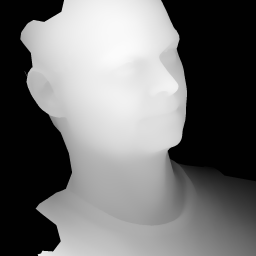

# Deep learning based 3D landmark placement
A tool for precisely placing 3D landmarks on 3D facial scans

## Citing Deep-MVLM

If you use Deep-MVLM in your research, please cite the
[paper](TBD):
```
@inproceedings{paulsen2018multi,
  title={Multi-view Consensus CNN for 3D Facial Landmark Placement},
  author={Paulsen, Rasmus R and Juhl, Kristine Aavild and Haspang, Thilde Marie and Hansen, Thomas and Ganz, Melanie and Einarsson, Gudmundur},
  booktitle={Asian Conference on Computer Vision},
  pages={706--719},
  year={2018},
  organization={Springer}
}
```

## How to use Deep-MVLM
### Rendering types
The type of 3D rendering used is specified in the **image_channels** setting. The options are:
- **geometry** pure geometry rendering without texture (1 image channel)
- **depth** depth rendering (the z-buffer) similar to range scanners like the Kinect (1 image channel)
- **RGB** texture rendering (3 image channels)
- **RGB+depth** texture plus depth rendering (3+1=4 image channels)
- **geometry+depth** geometry plus depth rendering (1+1=2 image channels)

## How to use Deep-MVLM with the BU-3DFE dataset

The Binghamton University 3D Facial Expression Database (BU-3DFE) is a standard database for testing the performance of 3D facial analysis software tools. Here it is described how this database can be used to train and evaluate the performance of Deep-MVLM.

Start by requesting and downloading the database from [the official BU-3DFE site](http://www.cs.binghamton.edu/~lijun/Research/3DFE/3DFE_Analysis.html)

Secondly, download the 3D landmarks for the raw data from [Rasmus R. Paulsens homepage](http://people.compute.dtu.dk/rapa/BU-3DFE/BU_3DFE_84_landmarks_rapa.zip). The landmarks from the original BU-3DFE distribution is fitted to the cropped face data. Unfortunately, the raw and cropped face data are not in alignment. The data fra Rasmus' site has been aligned to the raw data, thus making it possible to train and evaluate on the raw face data. There are 84 landmarks in this set end they are defined as: (**TBD**)

A set of example JSON configuration files are provided. Use for example config_RGB_BU_3DFE.json and modify it to your needs. Change *raw_data_dir*, *processed_data_dir*, *data_dir* (should be equal to processed_data_dir) to your setup.

### Preparing the BU-3DFE data
In order to train the network the data should be prepared. This means that we pre-render a set of views for each input model. On the fly rendering during training is too slow due to the loading of the 3D models. Preparing the data is done by issuing the command:

```
python preparedata --c config_RGB_BU_3DFE.json
```

This will pre-render the image channels *rgb*, *geometry*, *depth*. If the *processed_data_dir* is set to for example *D:\\data\\BU-3DFE_processed\\*, the rendered images will be placed in a folder *D:\\data\\BU-3DFE_processed\\images\\* and the corresponding 2D landmarks in a folder *D:\\data\\BU-3DFE_processed\\2D LM\\*. The renderings should look like this:



The corresponding landmark file is a standard text file with landmark positions corresponding to their placement in the rendered images. This means that this dataset can now be used to train a standard 2D face landmark detector.

The dataset will also be split into a *training* and a *test* set. The ids of the scans used for training can be found in the *dataset_train.txt* file and the test set in the *dataset_test.txt* file.


### Training on the BU-3DFE


## Team
Rasmus R. Paulsen and Kristine Aavild Juhl

## License
Deep-MVLM is released under the MIT license. See the [LICENSE file](LICENSE) for more details.

## Credits
This project is based on the PyTorch template  [pytorch-template](https://github.com/victoresque/pytorch-template) by [Victor Huang](https://github.com/victoresque)

We gratefully acknowledge the support of NVIDIA Corporation with the donation of the Titan Xp GPU used for this research.
